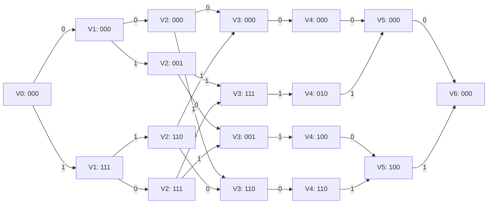

# ДЗ 6

$$
H=
\begin{pmatrix}
1 & 0 & 1 & 1 & 0 & 1 \\
1 & 0 & 1 & 0 & 1 & 0 \\
1 & 1 & 0 & 1 & 0 & 0
\end{pmatrix}.
$$

---

## 1. Столбцы проверочной матрицы

Обозначим столбцы матрицы $H$ через $h_i$:

$$
h_1=\begin{pmatrix}1\\1\\1\end{pmatrix},\quad
h_2=\begin{pmatrix}0\\0\\1\end{pmatrix},\quad
h_3=\begin{pmatrix}1\\1\\0\end{pmatrix},\quad
h_4=\begin{pmatrix}1\\0\\1\end{pmatrix},\quad
h_5=\begin{pmatrix}0\\1\\0\end{pmatrix},\quad
h_6=\begin{pmatrix}1\\0\\0\end{pmatrix}.
$$

Для краткости двоичный вектор синдрома $(a,b,c)$ будем записывать как строку `abc`.

---

## 2. Построение решётки по проверочной матрице

Для яруса $i$ множество состояний задаётся формулой

$$
V_i = \langle h_1,\dots,h_i\rangle \cap \langle h_{i+1},\dots,h_6\rangle,
$$

где $\langle \cdot \rangle$ — линейная оболочка над $\mathbb F_2$.

Это означает: состояние на ярусе $i$ должно одновременно

1. получаться как синдром, накопленный по первым $i$ символам;
2. допускать продолжение по оставшимся символам до полного синдрома $0$.

### Ярус $V_0$

$$
V_0 = \{000\}.
$$

### Ярус $V_1$

$$
\langle h_1\rangle = \{000,111\}.
$$

Вектор `111` выражается через оставшиеся столбцы, например

$$
111 = h_2+h_5+h_6,
$$

поэтому

$$
V_1=\{000,111\}.
$$

### Ярус $V_2$

$$
\langle h_1,h_2\rangle = \{000,001,110,111\}.
$$

Все эти векторы достижимы и по столбцам $h_3,\dots,h_6$, значит

$$
V_2=\{000,001,110,111\}.
$$

### Ярус $V_3$

$$
\langle h_1,h_2,h_3\rangle = \{000,001,110,111\}.
$$

Следовательно,

$$
V_3=\{000,001,110,111\}.
$$

### Ярус $V_4$

После четырёх столбцов уже получается всё пространство $\mathbb F_2^3$, а по оставшимся двум столбцам имеем

$$
\langle h_5,h_6\rangle = \{000,010,100,110\}.
$$

Значит,

$$
V_4=\{000,010,100,110\}.
$$

### Ярус $V_5$

$$
\langle h_6\rangle = \{000,100\},
$$

поэтому

$$
V_5=\{000,100\}.
$$

### Ярус $V_6$

$$
V_6=\{000\}.
$$

---

## 3. Множества состояний по ярусам

Итак, получаем следующий профиль состояний:

| Ярус | Состояния |
|---|---|
| $V_0$ | $\{000\}$ |
| $V_1$ | $\{000,111\}$ |
| $V_2$ | $\{000,001,110,111\}$ |
| $V_3$ | $\{000,001,110,111\}$ |
| $V_4$ | $\{000,010,100,110\}$ |
| $V_5$ | $\{000,100\}$ |
| $V_6$ | $\{000\}$ |

Число состояний по ярусам:

$$
1,\ 2,\ 4,\ 4,\ 4,\ 2,\ 1.
$$

---

## 4. Рёбра решётки

Переход из состояния $s\in V_{i-1}$ в состояние $s'\in V_i$ по метке $x_i\in\{0,1\}$ задаётся правилом

$$
s' = s + x_i h_i.
$$

Ниже выпишем все допустимые переходы.

### Между $V_0$ и $V_1$ ($h_1=111$)

- `000 --0--> 000`
- `000 --1--> 111`

### Между $V_1$ и $V_2$ ($h_2=001$)

- `000 --0--> 000`
- `000 --1--> 001`
- `111 --0--> 111`
- `111 --1--> 110`

### Между $V_2$ и $V_3$ ($h_3=110$)

- `000 --0--> 000`
- `000 --1--> 110`
- `001 --0--> 001`
- `001 --1--> 111`
- `110 --0--> 110`
- `110 --1--> 000`
- `111 --0--> 111`
- `111 --1--> 001`

### Между $V_3$ и $V_4$ ($h_4=101$)

- `000 --0--> 000`
- `001 --1--> 100`
- `110 --0--> 110`
- `111 --1--> 010`

### Между $V_4$ и $V_5$ ($h_5=010$)

- `000 --0--> 000`
- `010 --1--> 000`
- `100 --0--> 100`
- `110 --1--> 100`

### Между $V_5$ и $V_6$ ($h_6=100$)

- `000 --0--> 000`
- `100 --1--> 000`

---

## 5. Схема

---

## 6. Синдромная решётка этого кода

Для синдромной решётки вводится **частичный синдром**

$$
\sigma_i = \sum_{j=1}^{i} x_j h_j,
\qquad \sigma_0=000.
$$

Тогда переход на $i$-м шаге задаётся точно той же формулой:

$$
\sigma_i = \sigma_{i-1} + x_i h_i.
$$

Так как для кодового слова полный синдром должен быть равен нулю,

$$
\sigma_6 = \sum_{j=1}^{6} x_j h_j = 000,
$$

то допустимые состояния на ярусе $i$ — это все такие частичные синдромы, которые можно продолжить до нуля на последнем ярусе. Следовательно,

$$
\Sigma_i = \langle h_1,\dots,h_i\rangle \cap \langle h_{i+1},\dots,h_6\rangle.
$$

Но это в точности та же формула, что и для состояний $V_i$ решётки, построенной по проверочной матрице:

$$
\Sigma_i = V_i \quad \text{для всех } i=0,1,\dots,6.
$$

То есть множества состояний совпадают:

| Ярус | Состояния синдромной решётки |
|---|---|
| $\Sigma_0$ | $\{000\}$ |
| $\Sigma_1$ | $\{000,111\}$ |
| $\Sigma_2$ | $\{000,001,110,111\}$ |
| $\Sigma_3$ | $\{000,001,110,111\}$ |
| $\Sigma_4$ | $\{000,010,100,110\}$ |
| $\Sigma_5$ | $\{000,100\}$ |
| $\Sigma_6$ | $\{000\}$ |

И правило переходов тоже совпадает:

$$
\sigma_i = \sigma_{i-1} + x_i h_i.
$$

Следовательно, **решётка, построенная по проверочной матрице, совпадает с синдромной решёткой этого же кода с точностью до переобозначения вершин на ярусах**.

---

## 7. Дополнительная проверка: число путей равно числу кодовых слов

Ранг матрицы $H$ равен $3$, длина кода $n=6$, значит размерность кода

$$
k = 6-3 = 3.
$$

Следовательно, код содержит

$$
2^k = 2^3 = 8
$$

кодовых слов. В построенной решётке действительно существует ровно 8 полных путей из `000` в `000`, а именно:

- `000000`
- `001011`
- `010101`
- `011110`
- `100110`
- `101101`
- `110011`
- `111000`

Все они удовлетворяют проверочному соотношению

$$
Hx^T=0.
$$

---

## Ответ

Построенная по проверочной матрице решётка имеет состояния по ярусам

$$
\{000\},\quad
\{000,111\},\quad
\{000,001,110,111\},\quad
\{000,001,110,111\},\quad
\{000,010,100,110\},\quad
\{000,100\},\quad
\{000\}.
$$

Переходы между состояниями определяются формулой

$$
s_i = s_{i-1} + x_i h_i.
$$

Синдромная решётка строится по точно тому же правилу для частичных синдромов, поэтому она имеет те же множества состояний и те же рёбра. Значит, обе решётки совпадают с точностью до нумерации узлов на каждом ярусе.
