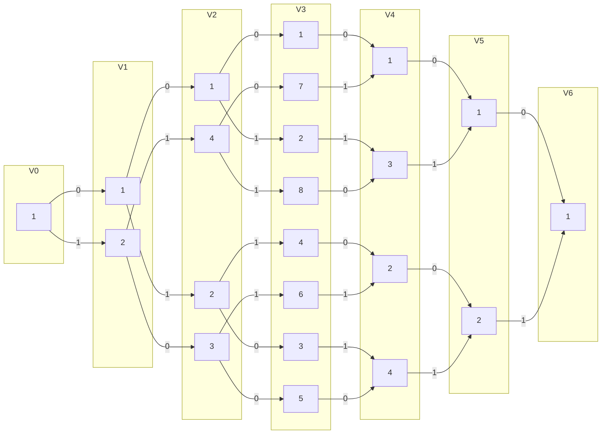
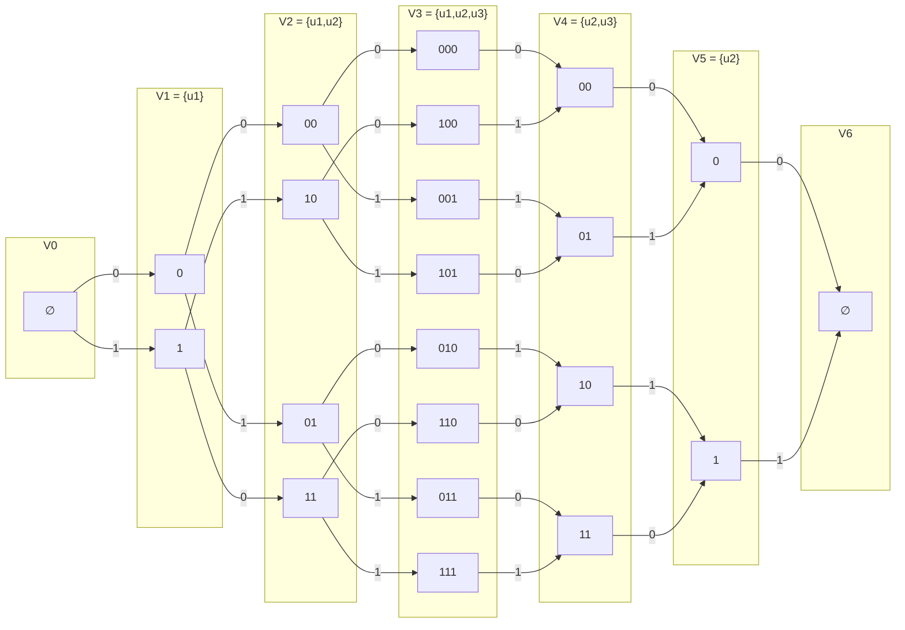
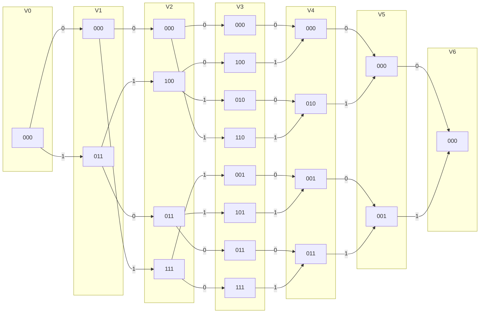

# ДЗ 7. Построение трёх решёток для линейного кода

Дана порождающая матрица

$$
G=
\begin{pmatrix}
1&0&1&1&0&1\\
0&0&1&1&1&0\\
0&1&0&1&1&1
\end{pmatrix}.
$$

Код имеет параметры $(n,k)=(6,3)$, поэтому содержит $2^3=8$ кодовых слов.

---

## 1. Решётка по кодовым словам

Сначала выпишем все кодовые слова.

| ИС | КС |
|---|---|
| 000 | 000000 |
| 100 | 101101 |
| 010 | 001110 |
| 001 | 010111 |
| 110 | 100011 |
| 101 | 111010 |
| 011 | 011001 |
| 111 | 110100 |

Обозначим через $F_i(c^{(p)})$ множество суффиксов, которыми префикс $c^{(p)}$ длины $i$ можно дополнить до кодового слова.  
Два префикса на ярусе $i$ считаются эквивалентными, если соответствующие множества будущих продолжений совпадают.

### Классы эквивалентности префиксов

| Ярус | Состояния |
|---|---|
| $V_0$ | $1:\{\varnothing\}$ |
| $V_1$ | $1:\{0\}$, $2:\{1\}$ |
| $V_2$ | $1:\{00\}$, $2:\{01\}$, $3:\{10\}$, $4:\{11\}$ |
| $V_3$ | $1:\{000\}$, $2:\{001\}$, $3:\{010\}$, $4:\{011\}$, $5:\{100\}$, $6:\{101\}$, $7:\{110\}$, $8:\{111\}$ |
| $V_4$ | $1:\{0000,1101\}$, $2:\{1011,0110\}$, $3:\{0011,1110\}$, $4:\{0101,1000\}$ |
| $V_5$ | $1:\{00000,11010,00111,11101\}$, $2:\{10110,01100,01011,10001\}$ |
| $V_6$ | $1:\{c_m\}$ |

### Переходы между состояниями

- $V_0 \to V_1$:
  - $1 \xrightarrow{0} 1$
  - $1 \xrightarrow{1} 2$

- $V_1 \to V_2$:
  - $1 \xrightarrow{0} 1$
  - $1 \xrightarrow{1} 2$
  - $2 \xrightarrow{0} 3$
  - $2 \xrightarrow{1} 4$

- $V_2 \to V_3$:
  - $1 \xrightarrow{0} 1$
  - $1 \xrightarrow{1} 2$
  - $2 \xrightarrow{0} 3$
  - $2 \xrightarrow{1} 4$
  - $3 \xrightarrow{0} 5$
  - $3 \xrightarrow{1} 6$
  - $4 \xrightarrow{0} 7$
  - $4 \xrightarrow{1} 8$

- $V_3 \to V_4$:
  - $1 \xrightarrow{0} 1$
  - $2 \xrightarrow{1} 3$
  - $3 \xrightarrow{1} 4$
  - $4 \xrightarrow{0} 2$
  - $5 \xrightarrow{0} 4$
  - $6 \xrightarrow{1} 2$
  - $7 \xrightarrow{1} 1$
  - $8 \xrightarrow{0} 3$

- $V_4 \to V_5$:
  - $1 \xrightarrow{0} 1$
  - $2 \xrightarrow{0} 2$
  - $3 \xrightarrow{1} 1$
  - $4 \xrightarrow{1} 2$

- $V_5 \to V_6$:
  - $1 \xrightarrow{0} 1$
  - $2 \xrightarrow{1} 1$

---

## 2. Решётка по порождающей матрице

Приведём порождающую матрицу к минимальной спэновой форме:

$$
\begin{pmatrix}
1&0&1&1&0&1\\
0&0&1&1&1&0\\
0&1&0&1&1&1
\end{pmatrix}
\sim
\begin{pmatrix}
1&0&1&1&0&1\\
0&1&0&1&1&1\\
0&0&1&1&1&0
\end{pmatrix}
\sim
\begin{pmatrix}
1&1&1&0&1&0\\
0&1&0&1&1&1\\
0&0&1&1&1&0
\end{pmatrix}
\sim
\begin{pmatrix}
1&1&0&1&0&0\\
0&1&0&1&1&1\\
0&0&1&1&1&0
\end{pmatrix}.
$$

Обозначим эту матрицу через $G_{\min}$:

$$
G_{\min}=
\begin{pmatrix}
1&1&0&1&0&0\\
0&1&0&1&1&1\\
0&0&1&1&1&0
\end{pmatrix}.
$$

Тогда спэны строк:

- 1-я строка: $[1,4]$
- 2-я строка: $[2,6]$
- 3-я строка: $[3,5]$

### Кодовые слова в новом базисе

| ИС | КС |
|---|---|
| 000 | 000000 |
| 100 | 110100 |
| 010 | 010111 |
| 001 | 001110 |
| 110 | 100011 |
| 101 | 111010 |
| 011 | 011001 |
| 111 | 101101 |

### Активные строки на ярусах

Из спэнов видно:

- $V_0=\varnothing$
- $V_1=\{u_1\}$
- $V_2=\{u_1,u_2\}$
- $V_3=\{u_1,u_2,u_3\}$
- $V_4=\{u_2,u_3\}$
- $V_5=\{u_2\}$
- $V_6=\varnothing$

### Метки на рёбрах

Кодовые символы вычисляются по столбцам $G_{\min}$:

$$
\begin{aligned}
c_1 &= u_1,\\
c_2 &= u_1 \oplus u_2,\\
c_3 &= u_3,\\
c_4 &= u_1 \oplus u_2 \oplus u_3,\\
c_5 &= u_2 \oplus u_3,\\
c_6 &= u_2.
\end{aligned}
$$

---

## 3. Решётка по проверочной матрице

Найдём проверочную матрицу $H$ из условия

$$
G H^T = 0.
$$

Получаем

$$
H=
\begin{pmatrix}
0&1&1&1&0&0\\
1&1&1&0&1&0\\
1&1&0&0&0&1
\end{pmatrix}.
$$

Столбцы матрицы $H$:

$$
h_1=011,\quad
h_2=111,\quad
h_3=110,\quad
h_4=100,\quad
h_5=010,\quad
h_6=001.
$$

Состояние на ярусе $i$ — это синдром, который можно получить после обработки первых $i$ символов и который ещё допускает продолжение до кодового слова.

Переходы задаются правилом

$$
s_i = s_{i-1} \oplus c_i h_i.
$$

### Множества синдромов по ярусам

| Ярус | Синдромы |
|---|---|
| $V_0$ | $\{000\}$ |
| $V_1$ | $\{000,011\}$ |
| $V_2$ | $\{000,011,111,100\}$ |
| $V_3$ | $\{000,001,010,011,100,101,110,111\}$ |
| $V_4$ | $\{000,001,010,011\}$ |
| $V_5$ | $\{000,001\}$ |
| $V_6$ | $\{000\}$ |

